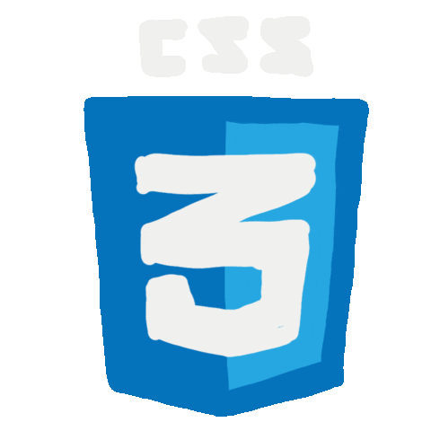

## Bonjour 👋

<h4 align="center">Je suis Hamza Ait Ahmed, futur ingénieur en informatique et réseaux, passionné par le développement full stack. Fort de solides expériences en front-end et back-end, notamment sur des projets en Spring Boot et Django, j'ai acquis un savoir-faire dans la création de plateformes interactives et optimisées pour l'expérience utilisateur. Polyvalent et motivé, je suis prêt à relever de nouveaux défis technologiques et à proposer des solutions innovantes.</h4>
 

<h1 align="center"><h1/>

## 🛠️ My favorite tools and technologies ⚙️

<table align="center">
  <tr>
    <td align="center" width="96">
      
       Java
    </td>
    <td align="center" width="96">
      
       Python
    </td>
    <td align="center"  width="96">
      
       HTML
    </td>
    <td align="center" width="96">
      
       CSS
    </td>
    <td align="center" width="96">
      
       Javascript
    </td>
  </tr>
  <tr>
    <td align="center" width="96">
      
       Spring
    </td>
    <td align="center" width="96">
      
       Django
    </td>
    <td align="center" width="96">
      
       Rest API
    </td>
    <td align="center" width="96">
      
       Postman
    </td>
    <td align="center" width="96">
      
       Docker
    </td>    
  </tr>
  <tr>
    <td align="center" width="96">
      
       Git
    </td>
    <td align="center"  width="96">
      
       GitLab
    </td>
    <td align="center" width="96">
      
       PostgreSQL
    </td>
    <td align="center" width="96">
      
       MongoDB
    </td>
    <td align="center" width="96">
      
       MySQL
    </td>
<!--   </tr> -->
<!--   <tr> -->
<!--     <td align="center" width="96">
      
       ASP.NET
    </td> -->
    
<!--     <td align="center" width="96">
      
       Redis
    </td> -->
    
<!--     <td align="center" width="96">
      
       Swagger
    </td> -->
  </tr>
<!--   <tr> -->
<!--   <td align="center" width="96">
      
       VS Code
    </td>
    <td align="center" width="96">
      
       Figma
    </td>
    <td align="center" width="96">
      
       Photoshop
    </td>
    <td align="center" width="96">
      
       Illustrator
    </td>
    <td align="center" width="96">
      
       Canva
    </td>
    </tr> -->
</table>

## 📊 Github Stats (Expand to View) 

 
  
<b>💻 GitHub Profile Stats</b>

   
  

    
 
  

 
  
<b> 📊 Top languages </b>

   
  

    &nbsp;
	  
    
 

 
  
<b>📊 GitHub Stats</b>

   
  

    
  

<h4 align="center">visitors number     </h4>

